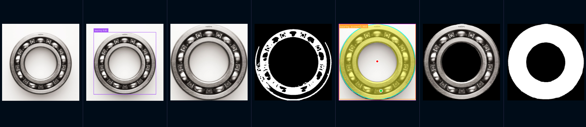

# CV Inspection

Computer-vision inspection pipeline for harmonic-drive assembly checks. The project combines
GroundingDINO open-vocabulary detection with MobileSAM segmentation, then normalizes the model
evidence into V-RAWA vision-layer outputs that can be consumed by HMI, audit logs, and an event
engine.

The current MVP focuses on bearing presence checks, confidence handling, ROI checks,
and evidence export.

## Functions

The main pipeline runs:

1. GroundingDINO detects candidate parts from a text prompt.
2. Detection crops are passed to MobileSAM.
3. MobileSAM segments each candidate with box and point prompts.
4. The vision service maps raw model labels to canonical parts.
5. The step checker compares observations against workflow rules.
6. The evidence writer saves images, masks, overlays, and JSON results.
7. The event builder emits a `VISION_STEP_CHECKED` event payload.

Low-confidence or suspicious evidence is treated conservatively. The pipeline reports
`needs_confirmation` instead of silently passing uncertain results.

## Repository Layout

```text
.
├── run_grounded_mobilesam_pipeline.py   # Main CLI entry point
├── services/vision_service/             # V-RAWA vision-layer service code
├── configs/                             # SOP, camera, model, and safety rules
├── tests/                               # Unit tests for vision service logic
├── image/                      # Sample harmonic-drive images and references
├── Global-output/                       # Example/generated pipeline outputs
├── GroundingDINO/                       # Vendored GroundingDINO code and checkpoint
├── MobileSAM-fast-finetuning/           # Vendored MobileSAM code and checkpoint
├── run_project.md                       # Extra run notes
└── requirements.txt                     # Top-level Python dependencies
```

## Requirements

- Python 3.10+ recommended
- PyTorch and torchvision
- OpenCV, NumPy, PyYAML, Pydantic
- GroundingDINO checkpoint at `GroundingDINO/weights/groundingdino_swint_ogc.pth`
- MobileSAM checkpoint at `MobileSAM-fast-finetuning/weights/mobile_sam.pt`
- CUDA-capable GPU recommended for normal inference

CPU execution is supported through CLI flags, but it will be much slower.

## Setup

Create and activate a Python environment:

```bash
python3 -m venv env
source env/bin/activate
python -m pip install --upgrade pip
python -m pip install -r requirements.txt
```

If GroundingDINO or MobileSAM need separate environments, pass them explicitly with
`--dino-python` and `--sam-python` when running the pipeline.

## Run The Pipeline

Example bearing inspection:

```bash
python3 run_grounded_mobilesam_pipeline.py \
  --image image/bearing.jpg \
  --text-prompt "bearing" \
  --output-dir Global-output \
  --work-order-id WO-20260427-001 \
  --station-id ST-A01 \
  --step-id S01 \
  --camera-id CAM-A01 \
  --view-id top
```

Run with explicit Python environments:

```bash
python3 run_grounded_mobilesam_pipeline.py \
  --image image/bearing.jpg \
  --text-prompt "bearing" \
  --output-dir Global-output \
  --dino-python GroundingDINO/env/bin/python \
  --sam-python env/bin/python
```

Force CPU execution:

```bash
python3 run_grounded_mobilesam_pipeline.py \
  --image image/bearing.jpg \
  --text-prompt "bearing" \
  --output-dir Global-output \
  --dino-device cpu \
  --sam-device cpu
```

## Main CLI Options

| Option | Purpose |
|---|---|
| `--image` | Input image path |
| `--text-prompt` | GroundingDINO text prompt |
| `--output-dir` | Directory for model outputs, evidence, and JSON |
| `--box-threshold` | GroundingDINO box threshold, default `0.3` |
| `--text-threshold` | GroundingDINO text threshold, default `0.25` |
| `--max-detections` | Maximum detections to process; `0` means all |
| `--dino-device` | Device for GroundingDINO, default `cuda` |
| `--sam-device` | Device for MobileSAM, default `cuda` |
| `--work-order-id` | Work order metadata for audit/event output |
| `--station-id` | Station metadata |
| `--step-id` | Workflow step ID, such as `S01`, `S02`, or `S03` |
| `--camera-id` | Camera ID used for ROI lookup |
| `--view-id` | View ID used for ROI lookup |

Run `python3 run_grounded_mobilesam_pipeline.py --help` for the full contract.

## Outputs

The pipeline writes raw model output, normalized vision output, event output, and visual evidence.

Key files:

```text
Global-output/
├── groundingdino/
│   ├── detections.json
│   ├── groundingdino_annotated.png
│   └── crops/
├── mobilesam/
│   └── detection_001/
│       ├── mask_result.json
│       ├── object_mask.png
│       ├── masked_object.png
│       └── result_overlay.png
├── evidence/
├── pipeline_result.json
├── vision_result.json
└── vision_event.json
```

`pipeline_result.json` keeps the merged raw GroundingDINO and MobileSAM evidence.

`vision_result.json` is the audit/debug/HMI-facing result. It includes work order metadata,
normalized detections, defect-like observations, `step_status`, confidence, and evidence paths.

`vision_event.json` wraps the result as a `VISION_STEP_CHECKED` event. It includes correlation and
idempotency keys, model/rule metadata, media references, and whether operator confirmation is
required.

The overall result in pictures is presented below:

Original img → GroundingDINO result → Bbox img → Binarization → MobileSAM result → Captured result → Object's mask

## Configuration

Operational rules live in YAML so SOPs and thresholds can change without editing Python code.

| File | Purpose |
|---|---|
| `configs/parts_lexicon.yaml` | Canonical part keys, aliases, zh_TW labels, and criticality |
| `configs/workflow_steps.yaml` | Expected parts, required flags, ROIs, and minimum confidence per step |
| `configs/safety_rules.yaml` | Confidence thresholds, risk levels, actions, and override policy |
| `configs/camera_config.yaml` | Camera/view definitions, ROIs, and lighting profile |
| `configs/model_registry.yaml` | Model names, versions, roles, and checkpoint IDs |

## Testing

Run the unit tests:

```bash
python3 -m unittest discover -s tests
```

Current tests focus on the safety-critical step-checker behavior:

- Low-confidence required parts produce `needs_confirmation`.
- Missing high-criticality required parts fail the step.

## Development Notes

-  Train your own weights for each model, the weights in this repo are pretrain model from the original repo.
- `run_grounded_mobilesam_pipeline.py` is intentionally thin. Most reusable logic lives under
  `services/vision_service/`.
- `services/vision_service/detector.py` owns subprocess command construction for GroundingDINO and
  MobileSAM.
- `services/vision_service/step_checker.py` translates model evidence into workflow status.
- `services/vision_service/schemas.py` defines strict Pydantic output contracts.
- `run_project.md` contains additional Chinese-language run notes and output field details.

Generated outputs and virtual environments should stay out of source control unless intentionally
capturing an example result.
